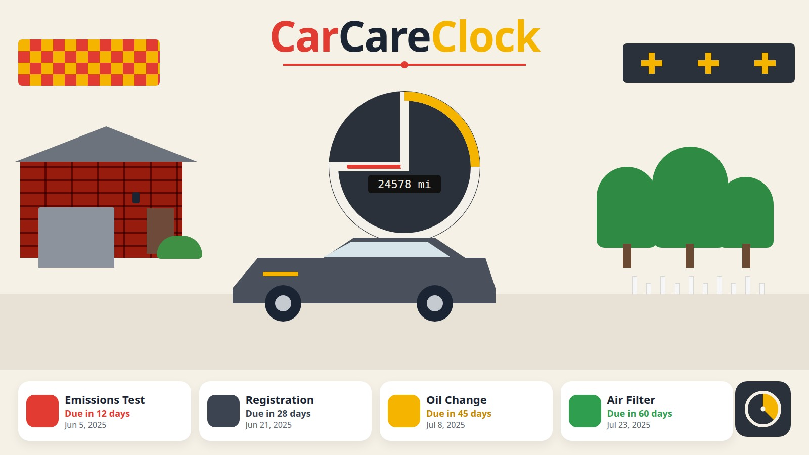

# CarCareClock

A local tracker for a household in Prince George's County, Maryland: emissions (VEIP), registration, and ordinary maintenance for one or more cars. Mileage, dates, and notes stay in a SQLite file on this computer. There is no account and no cloud service.

## Quick start

1. Download or clone this repository.
2. Double-click the launcher for this computer:
   - Mac: `Launch CarCareClock.command`
   - Windows: `Launch CarCareClock.bat`
   - Linux: `launch.sh`, or open `carcareclock.desktop`
3. The first run creates a `.venv`, installs the pinned packages in `requirements.txt`, and opens the app in the browser. Later runs start faster.

CarCareClock needs Python 3.11 or newer. If Python is missing, or it is too old, the launcher says so and links to [python.org/downloads](https://www.python.org/downloads/).

The app listens only on `127.0.0.1` and picks a free port (it tries 8731 first). The terminal prints the address.

A fictional Demo Kia and a fictional Demo Electric are created the first time the database is empty, so the dashboard is not blank. They are marked as demos. No VIN and no license plate are stored. Delete them from each vehicle's page when you add your own cars.

## What you can do

- See vehicle cards with an odometer, an estimated miles-per-day, and emissions, registration, oil, and engine air filter.
- See a due-soon timeline, and a reminder list of everything overdue or due within 7 days. Change that window on the dashboard.
- Log an odometer reading. The app estimates miles per day from recent readings and projects a date for mileage-based maintenance.
- Log a service with date, mileage, cost, shop, and notes. The latest service for an item is the start of the next interval.
- Edit each vehicle's intervals. New vehicles start from generic placeholders in `rules/maintenance_defaults.yaml`. Replace them with the owner's manual. Whichever of the mileage interval and the months interval comes first is the due date.
- Edit `rules/maryland.yaml` if the MVA changes a number. The planner reads that file. It is not hardcoded. Verify with MVA before you rely on a date. The research notes, URLs, and the date they were checked are in [docs/SOURCES.md](docs/SOURCES.md).
- Export `carcareclock.ics` from the header. Events are in `America/New_York` at 9:00, with a display alarm the same number of days ahead as the reminder window (7 by default), so you can subscribe from Google Calendar.
- Desktop notification when the app starts, and when you run `python -m carcareclock check`.

### Background checker, off by default

The app does not install a scheduled task by itself. These commands only write a file under `data/checkers/` unless you pass `--enable`:

```bash
python -m carcareclock install-checker launchd
python -m carcareclock install-checker cron
python -m carcareclock install-checker task
```

`scripts/install_launchd.sh`, `scripts/install_cron.sh`, and `scripts/install_task.ps1` do the same thing and do not pass `--enable`. The cron line is commented out. On a Mac, `--enable` runs `launchctl`. On Windows, `--enable` runs `schtasks`.

## Dev setup

```bash
python3 -m venv .venv
.venv/bin/python -m pip install -r requirements-dev.txt
.venv/bin/python -m carcareclock serve --no-browser
```

On Windows, use `python` and `.venv\Scripts\python.exe`.

## Tests

```bash
.venv/bin/python -m ruff check .
.venv/bin/python -m pytest
```

The tests cover whichever-comes-first, mileage projection (including a daylight-saving date), the VEIP and registration figures loaded from the YAML, the 7-day window, an `.ics` file that `icalendar` can parse in `America/New_York`, the daylight-saving alarm, the launchers, and an HTTP 200 from a server bound to `127.0.0.1`.

## Privacy

- The database is `data/carcareclock.sqlite`. `data/` is gitignored.
- There is no VIN field and no license plate field.
- Demo rows are fictional. Do not put a real home address, a real email, or a child's information in the shop or notes fields if you might share the database.
- The optional Flask secret used for flash messages is written to `data/secret.key` and is not committed.

## Optional packaged build

`scripts/build_app.py` uses PyInstaller. It is not required to run the app.

```bash
pip install -r requirements-build.txt
python scripts/build_app.py
```

On macOS that produces `dist/CarCareClock.app` with `assets/icon.icns`. On Windows it produces `dist/CarCareClock.exe` with `assets/icon.ico`. On Linux it produces a one-file binary, or you can skip packaging:

```bash
python scripts/build_app.py --skip
```

CI only needs to run on Linux, and it may skip the packaged build. The icon sources are `assets/icon.svg`, `assets/icon.png` (1024×1024), `assets/icon-512.png`, `assets/icon-1024.png`, `assets/icon.ico`, and `assets/icon.icns`. Regenerate the raster files with `python scripts/render_icon.py` after installing Pillow.

## Command line

```bash
python -m carcareclock status
python -m carcareclock check
python -m carcareclock export-ics --output carcareclock.ics
python -m carcareclock serve --no-browser --port 8731
```

## Limitations

- Verify with MVA. The YAML is a summary of public pages checked 2026-10-07, and those pages do not all use the same words. See [docs/SOURCES.md](docs/SOURCES.md). `https://emissions.mva.maryland.gov/` returned HTTP 500 that day.
- Maintenance defaults are generic placeholders, not a Kia (or any other) owner's manual.
- The cover in this README is a redraw of the attached banner. The original image file was not present on disk when the app was built.
- This environment is Linux. The Mac launcher and the Windows launcher were not run on those systems. The background-checker `--enable` path was not run. PyInstaller was not run.
- The `.ics` file was checked by parsing it with `icalendar`. It was not imported into a live Google Calendar.
- Desktop notifications use `osascript` on macOS, `notify-send` on Linux, and a PowerShell balloon on Windows. If the tool is missing, the check prints a line instead.
- A projected mileage date assumes the recent miles-per-day pace continues. It is an estimate.
